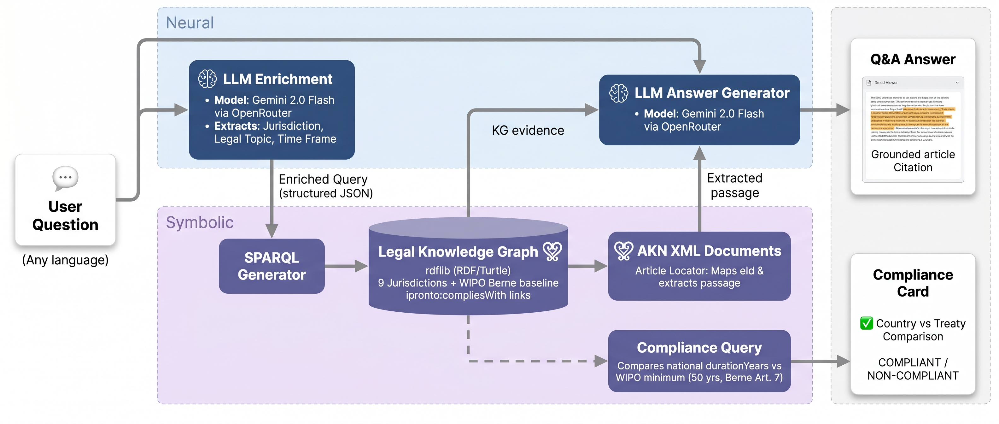

# Bidirectional Monitoring of WIPO Regulation and National Legislation: A Neuro-Symbolic Approach

**IRIS 2026 Hackathon**  
Brüne · Corazza · Longo · Sapienza · Vagnoni  
Supervisor: Prof. Monica Palmirani

---

## Architecture



The system combines a neural layer (LLM-based multilingual query enrichment and answer generation) with a symbolic layer (SPARQL queries over an RDF Knowledge Graph grounded in Akoma Ntoso legal documents and the IPROnto ontology).

---

## Two modes

**Q&A** — Ask a question in any language about intellectual property law. The system enriches the query, retrieves the relevant provision from the KG via SPARQL, extracts the passage from the AKN XML source document, and generates a grounded answer citing the article.

**Compliance Check** — Select a country to verify whether its national copyright duration meets the WIPO Berne Convention minimum (Art. 7, 50 years post-mortem). The check is purely symbolic: no LLM is involved.

---

## Stack

| Component | Technology |
|---|---|
| Web framework | Flask (Python) |
| Knowledge Graph | rdflib · RDF/Turtle · SPARQL |
| Legal documents | Akoma Ntoso XML (9 jurisdictions) |
| Ontology | IPROnto |
| LLM | Gemini 2.0 Flash via OpenRouter |
| Schema validation | Pydantic v2 |
| XML parsing | lxml |

---

## Setup

```bash
# install dependencies
uv sync

# add your OpenRouter API key
echo "OPENROUTER_API_KEY=your_key_here" > .env

# run
uv run python app.py
```

Open [http://localhost:5050](http://localhost:5050).

---

## Jurisdictions covered

Germany · France · Italy · Switzerland · United Kingdom · United States · Canada · New Zealand · European Union

---

## Paper

See [`paper_draft.md`](paper_draft.md) for the full system description, architecture details, and discussion of limitations and future work.
